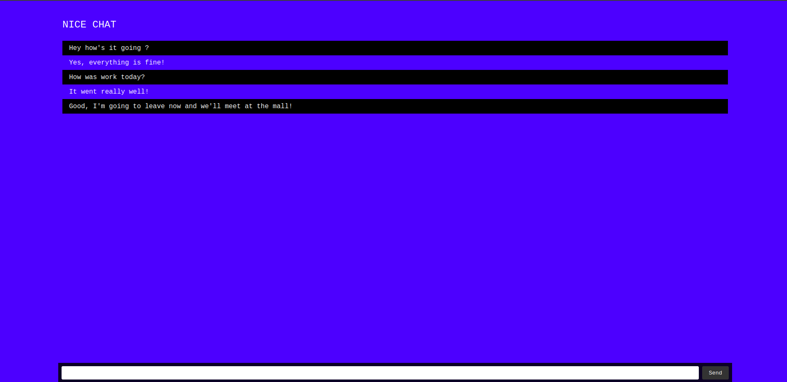

# Nice Chat

<p align="center">
    
</p>

This project is an Chat built using **TypeScript, NodeJs, WebSocket**

## Installation

1. Clone the repository:

```bash
git clone https://github.com/thomasgsquinaia/nice-chat
```

2. Install the dependencies:

```bash
npm install
```

5. Run the project

```bash
npm run dev
```